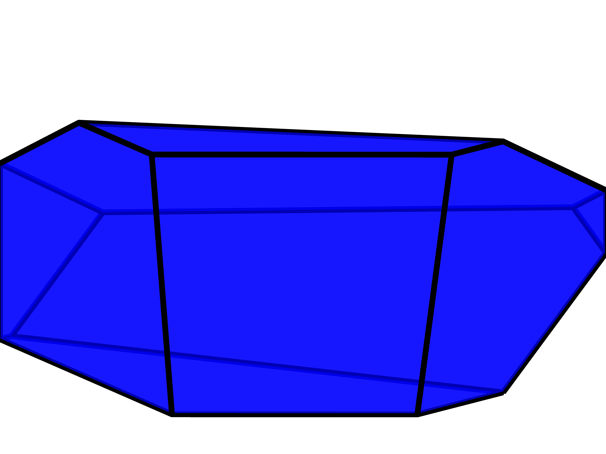
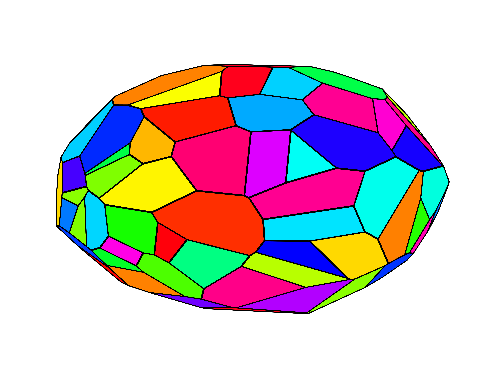

# plotPoly3D
Allows you to plot a three-dimensional convex polytope within Matlab.
The faces of the polytope are therby conserved rather than being devided into triangles which is often done by aproaches based on computing the [Delaunay triangulation](https://en.wikipedia.org/wiki/Delaunay_triangulation).
The polytope needs to be specified in its half-space representation
$$
\bm{A}\bm{x}\leq \bm{b},
$$
where $\bm{A}$ is a $n\times 3$ matrix and $b$ is a $n$-dimensional column vector.

The function uses the `con2vert` function from the [Matlab File Exchange](https://de.mathworks.com/matlabcentral/fileexchange/7894-con2vert-constraints-to-vertices) to compute the vertecies of the polytope. Redundant half-space constraints are removed using the `noredund` function which is solving a series of linear programs. The resulting vertecies are projected onto each face of the polytope to identify the vertecies for each face.

> Note that the function `con2vert` from Michael Kleder used to compute the polytopes vertecies is not written by me! Use at your own risk! Moreover, some Matlab toolboxes might be needed to run this code.

## Parameters
The function has the following parameters:
| Input  | Description | default |
| ------------- | ------------- | ------------- |
| `A` | the $n\times 3$ matrix $\bm{A}$ of the half-space representation | - |
| `b` | the $n$-dimensional column vector $\bm{b}$ of the half-space representation | - |
| `color` (optional) | the color of the polytope in the usual Matlab syntax, `'rand'` will result in a random color for each face| `'blue'` |
| `alpha` (optional) | alpha value of the polytope's faces | 0.5 |
| `linewidth` (optional) | the linewidth of the polytope's faces | 1.5 |
| `tol` (optional) | tolerance for the projection of the vertecies of the polytope to be considered for a given face | 1e-10 |

## Demo
The following plots were created using the demo.m file in the demo folder.

